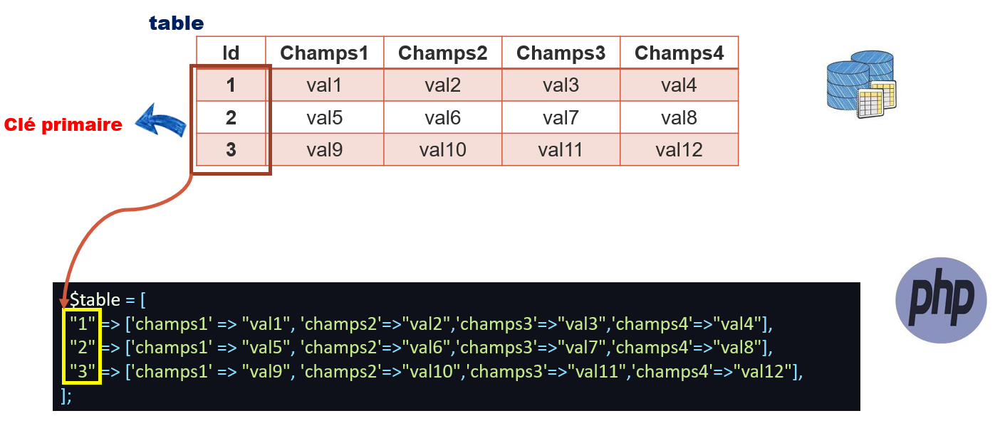
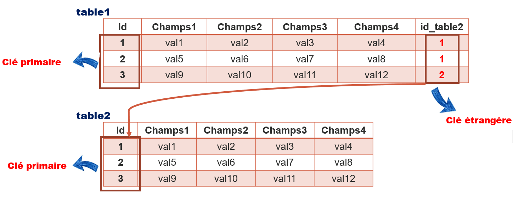
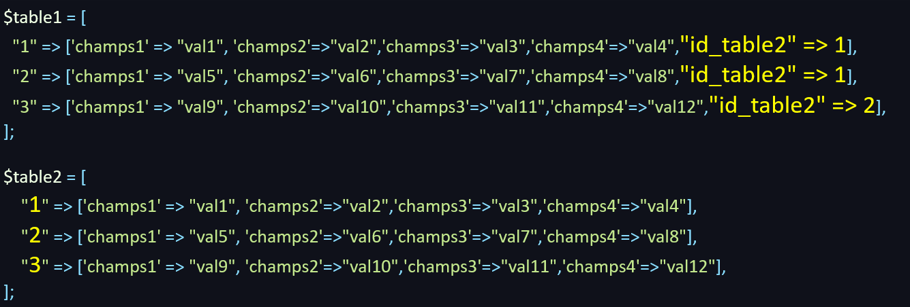

Pour revenir à la page du projet, cliquez [ICI](../README.md)

## Rappel base de données

--- 

Une **base de données** est constituée de **tables**.  
Une **table** est constituée d'**enregistrements**.   
Un **enregistrement** est constitué de **champs** et chaque **enregistrement**
est identifié par une **clé primaire**.  
La **clé primaire** doit être **UNIQUE** pour chaque **enregistrement**.

Pour représenter une **table** en **PHP**, on peut utiliser un **tableau à 2 dimensions** comme sur le schéma ci-dessous :

## Relations entre tables

Pour définir une **relation** entre **2 tables**, on utilise la notion de **clé primaire**.

Pour représenter une **relation** en PHP, on peut utiliser des **tableaux à 2 dimensions** comme décrit ci-dessous :

   