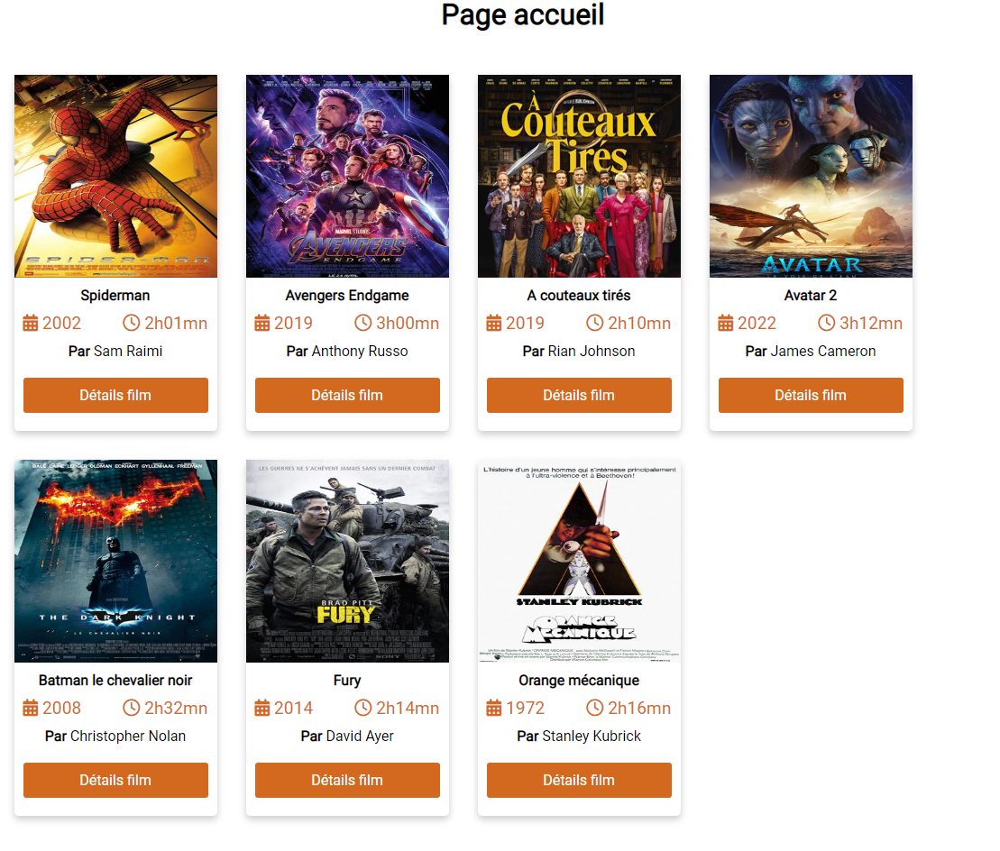

# TP Films

---

## Présentation

L'objectif de ce TP est de créer un site permettant de visualiser des films et le détail de chaque film.
Le site proposera une première page permettant de proposer l'ensemble des films. Chaque film devra être présenté sous la forme d'une **card** comme dans l'exemple ci-dessous:

Lors du clic sur **Détails film**, une nouvelle page **details-film.php**  doit s'afficher permettant la visualisation du film correspondant.

Concernant la visualisation d'un film, vous avez **carte blanche** afin de réaliser la mise en page !

## Quelques conseils

Concernant la liste des films, vous pouvez utiliser **flexbox** afin de gérer la disposition des différentes cartes, le tout devant être **responsive**.

Vous pouvez consulter le site [openclassroom](https://openclassrooms.com/fr/courses/1603881-creez-votre-site-web-avec-html5-et-css3/8061384-faites-votre-mise-en-page-avec-flexbox) afin d'avoir des précisions sur l'utilisation de la technologie **flexbox**.

Vous trouverez également dans le fichier [films.php](donnees/films.php) un tableau associatif contentant les différents films.

Vous trouverez dans le dossier *images* les affiches de chaque film.

Enfin, dans le fichier [fonctions.php](./fonctions.php), vous pourrez définir les différentes fonctions PHP nécéssaires à la réalisation du site.
