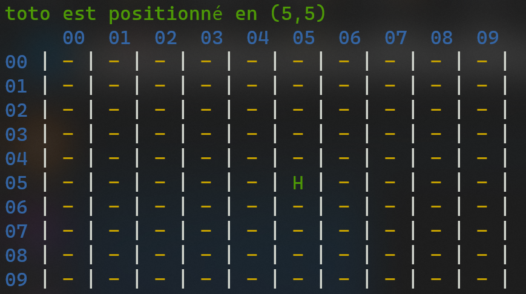
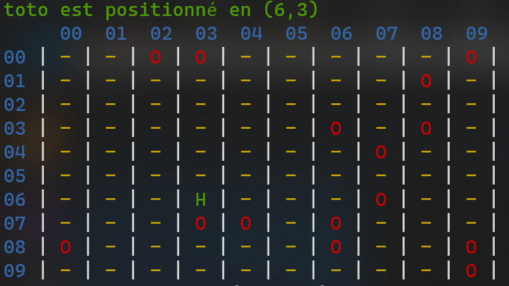
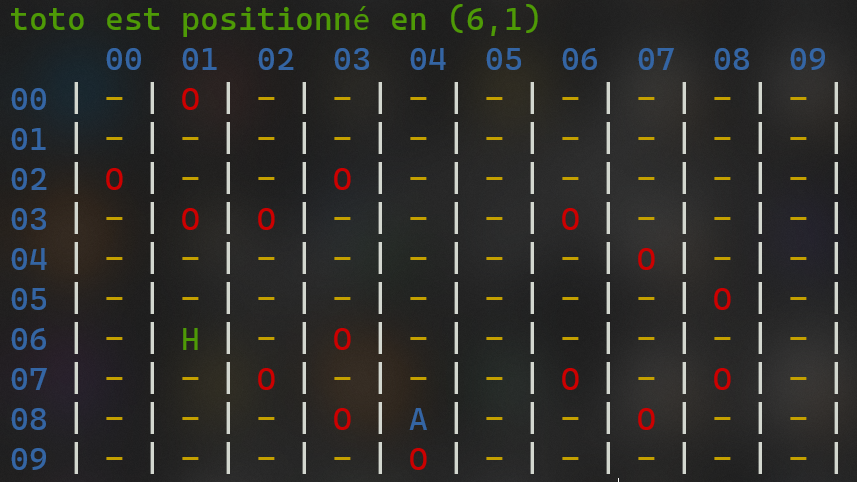

# Projet RPG

## Objectif

L'objectif de ce projet est de développer un jeu stype RPG simplifié en PHP.

## Travail à faire

### Etape 1

---

Le fichier [grille-sans-fonction.php](grille-sans-fonction.php) vous est donné.   
Ce fichier contient le code minimal sans décomposition en fonctions permettant de créer et d'afficher une grille dont les dimensions sont saisies par l'utilisateur.   
Dans un premier temps, votre premier travail consiste à créer les fonctions suivantes (dans le fichier [fonctions.php](fonctions.php)) :     

#### La fonction creerGrille
```php
// Cette fonction permet de créer la grille et de la retourner 
function creerGrille(int $largeur, int $hauteur) : array {

}
```

#### La fonction getGrille
```php
// Cette fonction permet de retourner (sous la forme d'une chaîne) la grille 
function getGrille(array grille, int largeur) : string {

}
```

Ensuite, utiliser le fichier [jeu.php](jeu.php) afin de ré-écrire, à l'aide des fonctions définies ci-dessus, le code contenu dans le fichier [grille-sans-fonction.php](grille-sans-fonction.php).

### Etape 2

---

Cette étape consiste à placer le héros du jeu dans la grille.    

Dans un premier temps, en plus de la saisie des dimensions de la grille, en début de jeu, vous demanderez également le nom du héros.    
Ensuite vous devez créer une fonction permettant de placer, de ***manière aléatoire***, le héros dans la grille. La position du héros sera identifiée dans la grille par le caractère '**H**'.   
Il conviendra de s'assurer que la position générée ne corresponde pas à une position autre que la position vide. En effet, il sera possible de placer, par la suite, des obstacles. Il faut donc vous assurer que la position initiale du héros ne soit pas celle d'un obstacle par exemple.

Ensuite, compléter le fichier [jeu.php](jeu.php) afin d'intégrer les fonctionnalités ci-dessus.   
> #### IMPORTANT !
> Lors de l'affichage de la grille, vous devrez indiquer la position du héros.
 
Voici un exemple d'affichage de la grille après avoir placé le héros (qui s'appelle ici **toto** : désolé pour l'imagination).   

    

### Etape 3

---

Cette étape consiste à placer aléatoirement des obstacles dans la grille.   
La position d'un obstacle sera identifiée dans la grille par le caractère '**O**'.   
> #### IMPORTANT !
> Le nombre d'obstacles à placer dépend de la dimension de la grille.   
> Il devra être égal à ***15%*** du nombre total de positions.   
 

 Pour ce faire, vous devez créer une fonction permettant de placer, de ***manière aléatoire***, les obstacles dans la grille.   
 Il conviendra de s'assurer que la position générée pour chaque obstacle ne corresponde pas à une position autre que la position vide.   

Ensuite, compléter le fichier [jeu.php](jeu.php) afin d'intégrer les fonctionnalités ci-dessus.   
Voici un exemple d'affichage de la grille après avoir placé les obstacles.    



### Etape 4

---

Cette étape consiste à placer aléatoirement la position vers laquelle le héros doit se rendre, que l'on va appeler le **point d'arrivée**.    
La position du point d'arrivée sera identifiée dans la grille par le caractère '**A**'.   
Pour ce faire, vous devez créer une fonction permettant de placer, de ***manière aléatoire***, le point d'arrivée dans la grille.   
Il conviendra de s'assurer que la position générée du point d'arrivée ne corresponde pas à une position autre que la position vide. 

Ensuite, compléter le fichier [jeu.php](jeu.php) afin d'intégrer les fonctionnalités ci-dessus.   
Voici un exemple d'affichage de la grille après avoir placé les obstacles.



### Etape 5

---

Cette étape consiste à "refactorer" votre code.   
Veuillez placer toutes vos constantes dans le fichier [constantes.php](constantes.php).   


